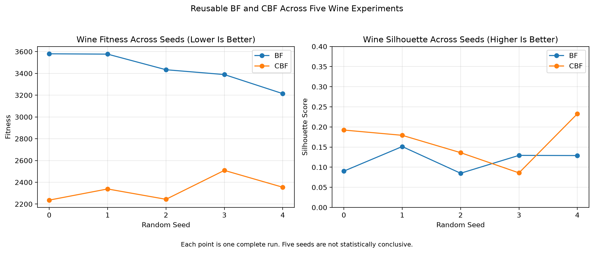

# Cultural Bacterial Foraging for Data Clustering

This repository is a Python reimplementation and incremental evaluation of a master's thesis that combines Bacterial Foraging Optimization with a Cultural Algorithm for data clustering.

The current repository is an exploratory prototype. It is not yet the complete thesis reproduction.

## Current Implementation

- Reproducible K-Means baseline
- Manual verification of the within-cluster squared-distance calculation
- Simplified BF population initialization
- Tumble-and-swim movement
- Bacterial health accumulation
- Reproduction
- Elimination-dispersal
- Situational cultural knowledge
- Normative cultural knowledge
- Iris comparison script
- Comparison visualization
- Wine K-Means baseline
- Wine PCA visualization
- Reusable BF implementation for Iris and Wine
- Reusable CBF prototype for Iris and Wine

## Project Files

- `iris_baseline.py`: K-Means baseline and manual distance verification
- `bf_iris.py`: Simplified BF prototype with tumble-and-swim, health accumulation, reproduction, and elimination-dispersal
- `cbf_iris.py`: Experimental CBF prototype with situational and normative knowledge
- `bf_reusable.py`: Reusable BF implementation with result validation for Iris and Wine
- `cbf_reusable.py`: Reusable CBF prototype with situational and normative knowledge
- `compare_iris.py`: Runs and compares the existing K-Means, BF, and CBF experiments
- `evaluate_wine_seeds.py`: Runs the verified five-seed Wine evaluation and creates the evaluation chart
- `iris_comparison.png`: Visual comparison of fitness and silhouette score
- `wine_baseline.py`: Loads and standardizes the Wine dataset, runs K-Means on all 13 standardized features, verifies the within-cluster squared-distance calculation, and creates a two-dimensional PCA visualization.
- `wine_clusters.png`: Displays the Wine K-Means clusters after projecting the 13 standardized features into two principal components.

## Wine K-Means Baseline

The Wine dataset contains 178 samples, 13 numerical features, and 3 known classes. The known class labels are loaded as reference information but are not used by K-Means during clustering.

| Metric | Result |
|---|---:|
| Samples | 178 |
| Features | 13 |
| Clusters | 3 |
| K-Means inertia | 1277.9285 |
| Silhouette score | 0.2849 |
| PCA variance represented by two components | 55.41% |

- K-Means was trained on all 13 standardized features.
- PCA was used only to create a two-dimensional visualization.
- The first two principal components represent approximately 55.41% of the original variance.
- Cluster identifiers do not automatically correspond to the known Wine class identifiers.
- The diagram does not prove that the clustering is correct.
- Wine inertia must not be compared directly with Iris inertia because the datasets have different sample counts, features, and distributions.
- Reusable BF and CBF runs use the standardized 13-feature Wine data directly.

## Wine Cluster Visualization


Each point represents one Wine sample. Colors represent K-Means cluster assignments. PCA is used only for visualization; clustering uses all 13 standardized features.

## Reusable BF and CBF Implementations

`bf_reusable.py` exposes `run_bf`, which initializes a bacterial population, evaluates within-cluster squared distance, performs tumble-and-swim movement, accumulates health, reproduces, and applies elimination-dispersal. `cbf_reusable.py` exposes `run_cbf`, extending this prototype with situational and normative knowledge. Both functions return fitness, silhouette, labels, centers, population state, and diagnostic counters.

These are reusable exploratory implementations. They are not a claim that the thesis has been fully reproduced, and the CBF implementation is not a complete Cultural Algorithm.

### Temporary Prototype Settings

Unless overridden, the reusable functions currently use these temporary prototype settings:

- 20 bacteria
- 50 iterations
- 3 clusters
- BF/CBF step size of 0.1
- At most 3 swim steps per movement
- CBF acceptance ratio of 0.35, cultural influence of 0.05, and reproduction and elimination intervals of 10 iterations

These settings are implementation defaults for repeatable experiments, not verified thesis parameters.

### Temporary Empty-Cluster Policy

The current temporary policy rejects any candidate whose nearest-center assignments do not contain every requested cluster. Rejected candidates receive infinite fitness and are not accepted into the optimization state. The policy is checked by the reusable regression tests, but its equivalence to the thesis policy is an **unverified interpretation**.

## Verified Reusable Results

Results below were generated with random seed 42, three clusters, and the reusable default settings. Lower fitness is better and higher silhouette is generally better.

| Dataset | Method | Fitness | Silhouette | Nonempty clusters |
|---|---|---:|---:|---:|
| Iris | Reusable BF | 176.8929 | 0.4483 | 3 |
| Iris | Reusable CBF | 152.6087 | 0.4566 | 3 |
| Wine | Reusable BF | 3366.1483 | 0.1528 | 3 |
| Wine | Reusable CBF | 2316.0097 | 0.1722 | 3 |

The seed-42 values are regression results for this prototype configuration. They do not establish that CBF is generally superior.

### Wine Five-Seed Evaluation

The verified Wine evaluation uses seeds 0 through 4. Each run produced 3 nonempty clusters.

| Method | Mean fitness | Fitness standard deviation | Mean silhouette | Silhouette standard deviation |
|---|---:|---:|---:|---:|
| BF | 3438.8466 | 135.5958 | 0.1169 | 0.0254 |
| CBF | 2336.5023 | 98.8359 | 0.1653 | 0.0503 |

The five-seed results are an initial stability check only. Five seeds are insufficient to establish statistical significance, and the results do not prove general CBF superiority.



## Current Iris Results

| Method | Fitness | Silhouette |
|---|---:|---:|
| K-Means | 139.8205 | 0.4599 |
| BF prototype | 176.8929 | 0.4483 |
| CBF prototype | 157.4860 | 0.4571 |

- Lower fitness is better.
- Higher silhouette is generally better.
- K-Means currently has the strongest result.
- CBF performs better than BF in this fixed-seed experiment.
- These results are descriptive, not statistical.

## Comparison Chart


Comparison on standardized Iris data using three clusters and one fixed random seed.

## Dataset

Iris contains:

- 150 samples
- 4 numerical features
- 3 known classes

The known labels are not used during clustering optimization.

## Installation

```powershell
py -m venv .venv
.venv\Scripts\Activate.ps1
python -m pip install -r requirements.txt
```

## Run the Experiments

```powershell
python wine_baseline.py
```
