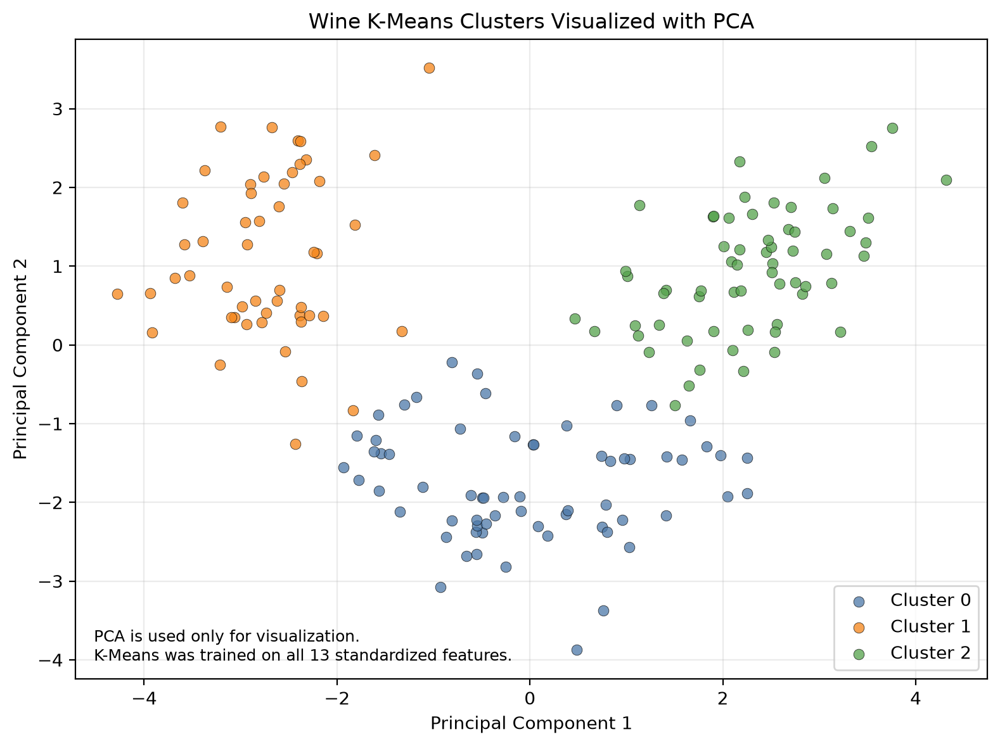

# Cultural Bacterial Foraging for Data Clustering

This repository is a Python reimplementation and incremental evaluation of a master's thesis that combines Bacterial Foraging Optimization with a Cultural Algorithm for data clustering.

The current repository is an exploratory prototype. It is not yet the complete thesis reproduction.

## Current Implementation

- Reproducible K-Means baseline
- Manual verification of the within-cluster squared-distance calculation
- Simplified BF population initialization
- Tumble-and-swim movement
- Bacterial health accumulation
- Reproduction
- Elimination-dispersal
- Situational cultural knowledge
- Normative cultural knowledge
- Iris comparison script
- Comparison visualization
- Wine K-Means baseline
- Wine PCA visualization

## Project Files

- `iris_baseline.py`: K-Means baseline and manual distance verification
- `bf_iris.py`: Simplified BF prototype with tumble-and-swim, health accumulation, reproduction, and elimination-dispersal
- `cbf_iris.py`: Experimental CBF prototype with situational and normative knowledge
- `compare_iris.py`: Runs and compares the existing K-Means, BF, and CBF experiments
- `iris_comparison.png`: Visual comparison of fitness and silhouette score
- `wine_baseline.py`: Loads and standardizes the Wine dataset, runs K-Means on all 13 standardized features, verifies the within-cluster squared-distance calculation, and creates a two-dimensional PCA visualization.
- `wine_clusters.png`: Displays the Wine K-Means clusters after projecting the 13 standardized features into two principal components.

## Wine K-Means Baseline

The Wine dataset contains 178 samples, 13 numerical features, and 3 known classes. The known class labels are loaded as reference information but are not used by K-Means during clustering.

| Metric | Result |
|---|---:|
| Samples | 178 |
| Features | 13 |
| Clusters | 3 |
| K-Means inertia | 1277.9285 |
| Silhouette score | 0.2849 |
| PCA variance represented by two components | 55.41% |

- K-Means was trained on all 13 standardized features.
- PCA was used only to create a two-dimensional visualization.
- The first two principal components represent approximately 55.41% of the original variance.
- Cluster identifiers do not automatically correspond to the known Wine class identifiers.
- The diagram does not prove that the clustering is correct.
- Wine inertia must not be compared directly with Iris inertia because the datasets have different sample counts, features, and distributions.
- BF and CBF are not yet implemented for the Wine dataset.

## Wine Cluster Visualization



Each point represents one Wine sample. Colors represent K-Means cluster assignments. PCA is used only for visualization; clustering uses all 13 standardized features.

## Current Iris Results

| Method | Fitness | Silhouette |
|---|---:|---:|
| K-Means | 139.8205 | 0.4599 |
| BF prototype | 176.8929 | 0.4483 |
| CBF prototype | 157.4860 | 0.4571 |

- Lower fitness is better.
- Higher silhouette is generally better.
- K-Means currently has the strongest result.
- CBF performs better than BF in this fixed-seed experiment.
- These results are descriptive, not statistical.

## Comparison Chart


Comparison on standardized Iris data using three clusters and one fixed random seed.

## Dataset

Iris contains:

- 150 samples
- 4 numerical features
- 3 known classes

The known labels are not used during clustering optimization.

## Installation

```powershell
py -m venv .venv
.venv\Scripts\Activate.ps1
python -m pip install -r requirements.txt
```

## Run the Experiments

```powershell
python wine_baseline.py
```
