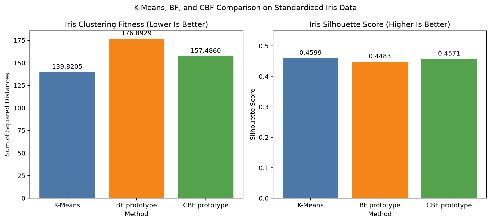

# Cultural Bacterial Foraging for Data Clustering

This repository is a Python reimplementation and incremental evaluation of a master's thesis that combines Bacterial Foraging Optimization with a Cultural Algorithm for data clustering.

The current repository is an exploratory prototype. It is not yet the complete thesis reproduction.

## Current Implementation

- Reproducible K-Means baseline
- Manual verification of the within-cluster squared-distance calculation
- Simplified BF population initialization
- Tumble-and-swim movement
- Bacterial health accumulation
- Reproduction
- Elimination-dispersal
- Situational cultural knowledge
- Normative cultural knowledge
- Iris comparison script
- Comparison visualization

## Project Files

- `iris_baseline.py`: K-Means baseline and manual distance verification
- `bf_iris.py`: Simplified BF prototype with tumble-and-swim, health accumulation, reproduction, and elimination-dispersal
- `cbf_iris.py`: Experimental CBF prototype with situational and normative knowledge
- `compare_iris.py`: Runs and compares the existing K-Means, BF, and CBF experiments
- `iris_comparison.png`: Visual comparison of fitness and silhouette score

## Current Iris Results

| Method | Fitness | Silhouette |
|---|---:|---:|
| K-Means | 139.8205 | 0.4599 |
| BF prototype | 176.8929 | 0.4483 |
| CBF prototype | 157.4860 | 0.4571 |

- Lower fitness is better.
- Higher silhouette is generally better.
- K-Means currently has the strongest result.
- CBF performs better than BF in this fixed-seed experiment.
- These results are descriptive, not statistical.

## Comparison Chart



Comparison on standardized Iris data using three clusters and one fixed random seed.

## Dataset

Iris contains:

- 150 samples
- 4 numerical features
- 3 known classes

The known labels are not used during clustering optimization.

## Installation

```powershell
py -m venv .venv
.venv\Scripts\Activate.ps1
python -m pip install numpy scikit-learn matplotlib
```
